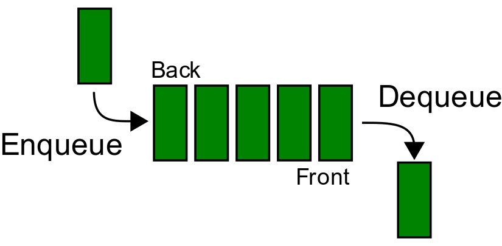
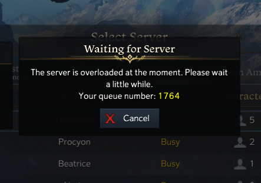

# Queues
## Overview
Have you ever stood in line for concert tickets? You start at the back and slowly make your way to the front as people get their tickets.


If you have then you already know what a **queue** is.
### **First In First Out**
Just like a line for concert tickets, queues use a **first in first out** system where the first thing to be placed in a queue is the first thing to be removed.



In our concert example the first person in line is sold a ticket before anyone else.

### Common Uses of Queues
Queues are a very common data structures in computer science. One place you have experienced them is when you use the internet.

**Networks** use queues to make sure that people can retrieve data in the order that they requested it.

When you sign into a website it puts you into a queue to access their services. If too many people are trying to log in at once you might see a screen like this.



It even tells you you are in a queue!

Making a **phone call** also makes use of queues. 


### **Common Operations**
* **Enqueue**
    * Places a new value at the end of the queue. Values cannot be added to any place but the end.
* **Dequeue**
    * Retrieves the value at the front of the queue. Values cannot be retrieved from any place but the beginning.
* **Size**
    * The size of the queue.
* **Empty**
    * Check if the queue is empty.

## Performance
The performance of a queue will change depending on the underlying data structure used.
This tutorial will explain how to implement a queue with a **[dynamic array](#using-dynamic-arrays)** and with a **[linked list](#using-a-linked-list)**.
## Queues with Python
### **Using Dynamic Arrays**
We can implement a **Queue** in python using an array.

If you do not understand dynamic arrays click the link below.

[**Dynamic Arrays in Python (GeeksforGeeks)**](https://www.geeksforgeeks.org/implementation-of-dynamic-array-in-python/)


Here is an example:
```python
class Queue()
    def __init__(self):
        # Store the length so that we can access it in O(1) time
        self.length = 0
        # Dynamic array that holds the data
        self.queue = []

    def enqueue(self, data):
        # Add to the end of the queue
        self.queue.append(data)
        # Adjust the length
        self.length += 1

    def dequeue(self):
        # if there is nothing in the queue then we cant return 
        # anything
        if self.length > 0:
            # Adjust the length
            self.length -= 1
            # The first item in the queue gets returned
            return self.queue.pop(0)

    def empty(self):
        # Returns true if the queue is empty
        return self.length <= 0
```
In this example our **Queue** has a length attribute, a dequeue function, and an enqueue function.
#### **Performance With a Dynamic Array**
* Enqueue - O(1)
    * Appending to a dynamic array takes O(1) time
* Dequeue - O(n)
    * Using an array means we have to shift every other element in the array when we remove the first element
* Size - O(1)
    * Size is stored as an attribute of the object so retrieving it takes O(1) time

### Using A Linked List
Learn about **Linked Lists** here: [Linked Lists](2-LinkedList.md#queues-using-linked-lists)

```python
class Queue()
    def __init__(self):
        # Store the length so that we can access it in O(1) time
        self.length = 0
        # Dynamic array that holds the data
        self.queue = LinkedList()

    def enqueue(self, data):
        # Add to the end of the queue
        self.queue.inserttail(data)
        # Adjust the length
        self.length += 1

    def dequeue(self):
        # if there is nothing in the queue then we cant return 
        # anything
        if self.length > 0:
            # Adjust the length
            self.length -= 1
            # The first item in the queue gets returned
            data = self.queue.head.data
            self.queue.removehead()
            return data
```

#### **Performance With a Linked List**
* Enqueue - O(1)
    * Adding to the end of a linked list takes O(1) time. [Linked List Performance](2-LinkedList.md#performance)
* Dequeue - O(1)
    * removing from the front of a linked list takes O(1) time. [Linked List Performance](2-LinkedList.md#performance)
* Size - O(1)
    * Size is stored as an attribute of the object so retrieving it takes O(1) time

## Common Mistakes

## Example of Using a Queue in Python

## Try It Yourself