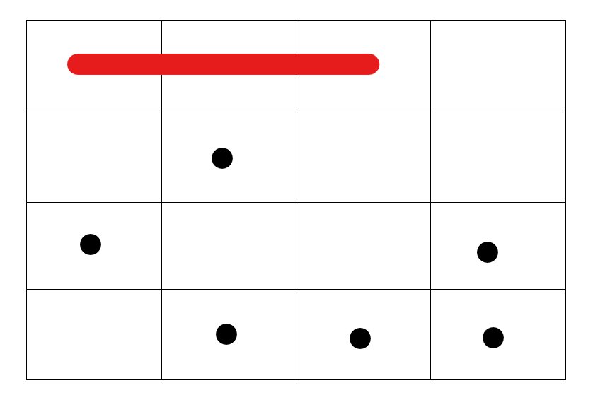
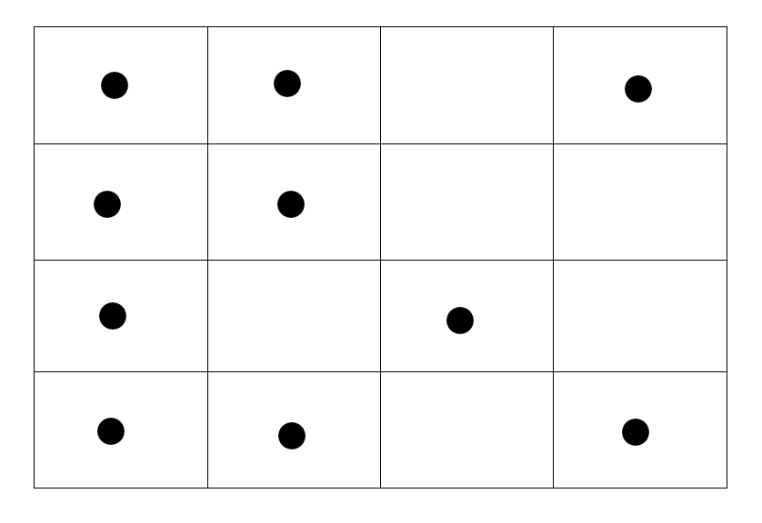
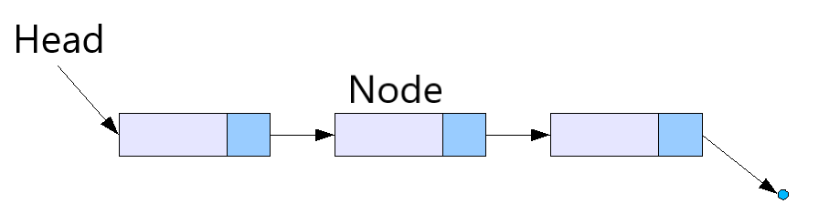
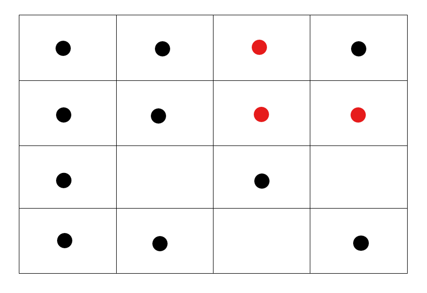
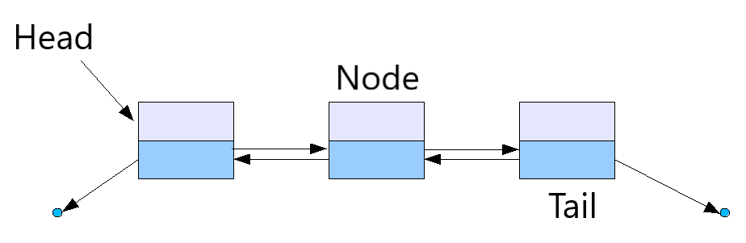

# Linked Lists

## Overview
[Arrays](https://www.geeksforgeeks.org/introduction-to-arrays/) are very useful in computer science but they have some weaknesses. 

The main weakness is the need for contiguous memory. 

In this image each box represents a memory location. The black dots represent memory locations that are currently in use.
The red line represents an array of size 3. Notice how the array occupies memory spaces in order.



What happens if we do not have enough memory spaces in order to create our array? 

In this image we see that most memory spaces are already used (filled with black dots). Because arrays use contiguous memory if we tried to create one it would either rewrite data or not be created.



**Linked Lists** are similar to arrays in that they store a list of similar things, however they do not require contiguous memory to be implemented. A single linked list (shown below) uses nodes that store the data and the memory address of the next element in the list. **This means that the memory that a linked list uses does not have to be contiguous.** The arrows in the image shows how each node points to the next. The **head** of a linked list is the first node and we use that to traverse the list.




In this image we see a linked list with three nodes being stored in memory. Black dots represent memory being used. Red dots represent a node in our linked list.



Now we can store our data without needing a lot of extra memory!

### Problems With Using Single Linked Lists
Single Linked Lists are amazing but they have some problems when compared to arrays. The first problem that you may have recognized is that arrays are very fast at retrieving values. Lets say that you want the 8th item in an array. Because the memory is contiguous you can take the beginning address and add the index to get the value you want. Because linked lists do not work the same in memory you have to traverse the list until you get to the node you want.

Another performance issue with single linked lists is **adding values to the end of the list.** To add a value you have to traverse the entire list to find the end. This results in O(n) time to add to our list. Compared to an Array which can append in O(1) time this is very inefficient. 

The last performance issue that I will touch on is that you **cannot traverse the list backwards**. Each node only knows the location of the next node.

How do we fix some of these issues? Well the solution is very simple.

## Doubly Linked Lists
Doubly linked lists are similar to single linked list except that every node contains the location of the previous and the next node in the list. Doubly linked lists also keep track of the last node in the list called the **tail**.



As you can see in this image each node points to the next and previous and we also keep track of the tail.

Keeping track of the tail and the previous nodes solves two of the issues we addressed above.

Firstly by keeping track of the tail (last node) adding to the end of the list goes from taking O(n) time to O(1) time. 

Secondly if given a node we can now traverse forward and backwards because each node contains the location of the previous and next.

## Common Operations and Performance
For performance we will focus on doubly linked lists.
* Insert Head
    * O(1) Adding a node before the current head takes O(1) time
* Remove Head
    * O(1) Removing the current head takes O(1) time
* Insert Tail
    * O(1) Adding a node at the tail takes O(1) time
* Remove Tail
    * O(1) Removing the current tail takes O(1) time
* Insert Middle
    * O(n) To insert in the middle you have to traverse to where you want to add the node so O(n) time. The actual adding operation takes O(1) time.
* Remove Middle
    * O(n) To remove from the middle you have to traverse to where you want to remove the node so O(n) time. The actual remove operation takes O(1) time.

## Common Uses
Doubly Linked lists have excellent performance at the start and end. This makes them perfect for implementing [queues](1-Queue.md#queues).
### Queues Using Linked Lists
[Code for Linked List Queue](1-Queue.md#using-a-linked-list)

Python has a built in library called deque which is a linked list (deque stands for double ended queue). Read more about it [here](https://www.geeksforgeeks.org/deque-in-python/).

## Linked Lists with Python
Below is the basic structure of a linked list written using two classes the node and the linked list. The node is what makes it a doubly linked list. It has both a previous and next attribute.

```python
class DoublyLinkedList():
    # Create an empty linked list with a length, head, and tail attribute
    def __init__(self):
        self.head = None
        self.tail = None
        self.length = 0

    def inserthead(self, data):
        # Create a new node
        node = DoublyLinkedList.Node(data)

        # If there is nothing in the list then the new node 
        # is both the head and tail
        if self.head == None:
            self.head = node
            self.tail = node
            self.length += 1
            return

        # set the previous of the current head to the new head
        self.head.previous = node
        # set the next of the new head to the previous head
        node.next = self.head
        # set the head to the new node
        self.head = node
        # add to the length
        self.length += 1

    def inserttail(self, data):
        # Create a new node
        node = DoublyLinkedList.Node(data)

        # If there is nothing in the list then the new node 
        # is both the head and tail
        if self.tail == None:
            self.tail = node
            self.head = node
            self.length += 1
            return

        # set the next of the old tail to the new node
        self.tail.next = node
        # set the previous of the node to the old tail
        node.previous = self.tail
        # set the tail to the new node
        self.tail = node
        # add to the length
        self.length += 1

class Node():
    # create a new node that contains some data and information about its neighbors in the list
    def __init__(self, data):
        self.next = None
        self.previous = None
        self.data = data
```
## Example of Using a Linked List in Python
In this example we will write a function that converts a dynamic array into a linked list.

We will start with the code [above](#linked-lists-with-python).

[Example Problem](code/examplelinkedlist.py)
```python
def convertDynamicArray(self, array):
        """
        This function takes a dynamic array and converts it to a linked list
        """
        # Add the data from the array into the linked list using the insert tail function
        for item in array:
            self.inserttail(item)
```

## Try It Yourself

Try using a linked list.

For this problem you will implement a combine function.

The function will combine two linked lists. The second linked list will be added to the end of the first linked list.

Work on this problem for 10-20 minutes before looking at the solution.

We will start with the code [above](#linked-lists-with-python).

[Try It Yourself Combine Linked Lists](code/trylinkedlists.py)

```python
def combineLinkedLists(l1, l2):
    """Your code here"""

    """End of problem"""
    pass
```

[Try It Yourself Possible Answer](solutions/trylinkedlistssolution.py)
