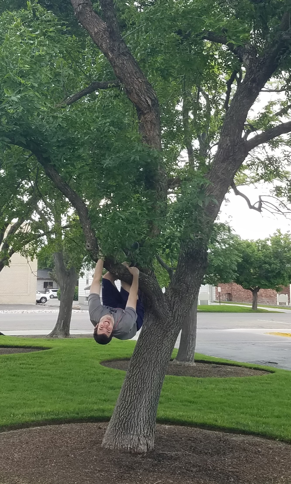
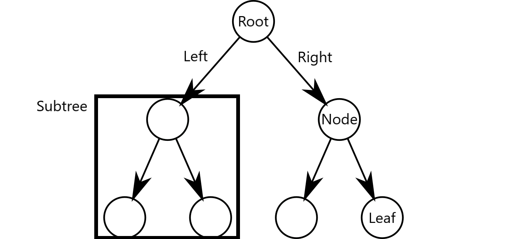
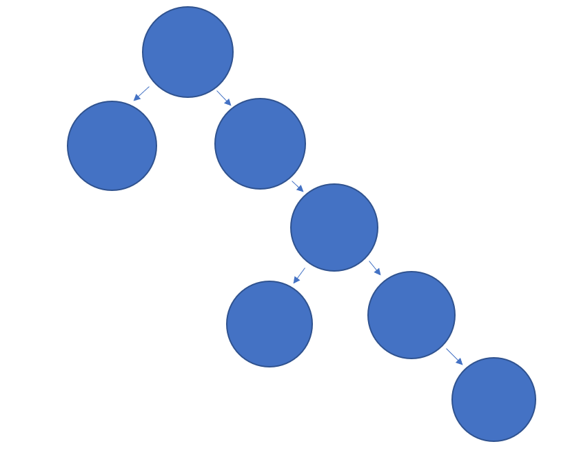

# Trees
## Overview
[Trees](https://en.wikipedia.org/wiki/Tree) are beautiful green plants that you can find in most climates on Earth.



However this is not the tree we are talking about when referring to computers.

Trees are "widely used abstract data type that represents a hierarchical tree structure with a set of connected nodes." [(Wikipedia)](https://en.wikipedia.org/wiki/Tree_(data_structure))

As stated above Trees similarly to [linked lists](2-LinkedList.md) use nodes to store data. The first node in a tree is referred to as the **root**. 

If we take a node and look at everything underneath it we have just created a **subtree**. The node that we start at is called the **parent** node and everything below is a **child** node.

Each node can have many children. A node with no children is called a **leaf**. A common type of tree is a **binary tree**. Binary tree's nodes have only two children.



Everything after this point will be in reference to binary trees.
## Binary Search Trees
A binary search tree is a binary tree that follows rules for where data will be placed. 

The rules are:

* "The left subtree of a node contains only nodes with keys lesser than the node’s key."

* "The right subtree of a node contains only nodes with keys greater than the node’s key."

* "The left and right subtree each must also be a binary search tree."

[Source](https://www.geeksforgeeks.org/binary-search-tree-data-structure/)

We create an example of a BST [below](#code).
## Balancing Trees
A balanced tree is a tree in which the difference in **height** between the two subtrees of the root is not drastically different.

To calculate the height of a subtree you start at the parent node and follow the node locations until there are no more nodes. You then total the number of nodes you traversed and you have the height. [See Code](#code) below for how to calculate the height of a binary tree.

The tree displayed below is balanced.


The height of the right subtree is the same as the height of the left subtree.

The tree below is unbalanced.



The subtree on the right is much taller than the subtree on the left.
## Common Operations and Performance
The performance of a tree depends on it being balanced. These also assume that it is a binary search tree.

* Insert
    * O(log n) Recursively traverse the tree till we find an open spot to place the new node. Because we can follow a formula for placing the node we can eliminate half of the nodes with each check. Assuming the tree is balanced.
* Contains
    * O(log n) Recursively search the tree for the value. Because we can follow a formula for where the value would be in the tree we can remove half the nodes with each check. Assuming the tree is balanced.
* Remove
    * O(log n) to find the node to remove. The removal may require some extra time.
* Traverse
    * O(n) Must recursively check every node
* Height
    * O(n) Must traverse the entire tree recursively
* Size
    * O(1) Stored as attribute of the object
* Empty
    * O(1) Check the length

## Using Trees
Trees are used in compression algorithms. 

[Here](https://www.youtube.com/watch?v=yue6yqhmfSg) is an excellent example. 
## Recursion
Learn About Recursion In Depth - [Here](https://www.geeksforgeeks.org/recursion/)

Recursion is the act of a function calling itself. Recursion depends on two principles: base case and creating smaller problems.

Base Case
- Most often a boolean statement that will cause a function to return without calling itself. In the example below if our value is 0 then we return without calling the function.

Smaller Problem
- Think about a recursive function that adds all values from some number to zero. If we call that function with 3 as our starting number we could also say that it is the same as saying 3 + addingfunction(2). The problem that we are asking the function to answer has gotten smaller (from 3 to 2). 

```python
def recursiveadding(value):
    # Base case
    if value == 0:
        return 0
    # Recursive call              Smaller Problem
    return value + recursiveadding(value - 1)
```

Trees use recursion for many of their common operations. See the example [below](#code) for some examples of recursion with trees. For the example problem we will walk you through creating a function that will check if a value is in a tree.
## Trees with Python
Python has no builtin tree data structure so we will build our own.

We will create a tree class and a node class.

For this example there will be two functions insert and get height. 
### Code
```python
class BinaryTree():
    def __init__(self):
        self.root = None
        self.length = 0

    def addtotree(self, data, node = None):
        """
        This function inserts a node into our Binary search tree
        It uses recursion to find the correct spot to place the node
        Each function call creates a smaller problem by moving down the tree until there are no more nodes
        """
        # This if statement will be entered only when the function is first called
        if node == None:
            # Base Case
            if self.root == None:
                # if there is no root then the node becomes the root
                newnode = BinaryTree.Node(data)
                self.root = newnode
                self.length += 1
                return
            # Recursive Call
            else:
                # If there is a root then start there to check where to add the node
                self.addtotree(data, self.root)

        # This tree will place items to the right if they are greater than or equal to the current node
        elif data >= node.data:
            # Base Case
            if node.right == None:
                newnode = BinaryTree.Node(data)
                node.right = newnode
                self.length += 1
                return
            # Recursive Call
            else:
                self.addtotree(data, node.right)
        # This tree will place items to the left if they are less than the current node
        elif data < node.data:
            # Base Case
            if node.left == None:
                newnode = BinaryTree.Node(data)
                node.left = newnode
                self.length += 1
                return
            # Recursive Call
            else:
                self.addtotree(data, node.left)

    def getHeight(self, node = None):
        """
        This function returns the height of the tree
        This function uses recursion to find the branch with the longest height and returns it
        The problem gets smaller by traversing the tree until there are no more node to traverse
        """
        if node == None:
            # Base Case
            if self.root == None:
                return 0
            # Recursive Call
            return self.getHeight(self.root)

        # Base Case
        elif node.left == None and node.right == None:
            return 0

        # Recursive Call
        if node.left == None:
            return 1 + self.getHeight(node.right)

        # Recursive Call
        elif node.right == None:
            return 1 + self.getHeight(node.left)
        
        # Recursive Call
        else:
            if self.getHeight(node.right) >= self.getHeight(node.left):
                return 1 + self.getHeight(node.right)
            else:
                return 1 + self.getHeight(node.left)

    class Node():
        # Simple Node Class
        def __init__(self, data):
            self.data = data
            self.left = None
            self.right = None

```
## Common Mistakes
The most common mistake when using trees is problems with recursion. Forgetting base cases or not recursively calling a function when you need to will be the major problems you need to overcome.
## Example Code

In this example we will create a tree that contains letters. Our function will traverse the tree to spell out words. 

The function will return a string. The instructions will be passed as a string with the format of "10,10100,001,01," Where 1s mean go right and 0s mean go left. Commas tell the function what data to return. 

We start with the tree created [above](#code). 

[Example Problem - Contains](code/exampletrees.py)

```python
def traverseTree(self, traverseInstruction):
        """
        This function will traverse the tree according to the instructions provided in this format
        "1010,001,101,101," Where the 1s represent moves to the right and 0s represent moves to the left
        commas represent which data to return

        It will return a string with all the data requested.

        We will assume that the instructions will always be valid.
        """
        # start at the root
        node = self.root
        # create string to hold values
        results = ""
        # loop through the instructions
        for direction in traverseInstruction:
            #if the direction is a comma then add the data at the 
            # current node to the results and set the node to the root
            if direction == ",":
                results = results + node.data
                node = self.root
            # if direction is 1 then go to the right
            elif direction == "1":
                node = node.right
            # if direction is 0 then go to the left
            else:
                node = node.left
        return results
```

## Try It Yourself

Try using a tree.

For this problem you will be writing a function that will tell a user how many occurrences of a value there are in a tree.

Work on this problem for 20-40 Minutes before checking the solution.

[Try It Yourself Number of Occurrences](code/trytrees.py)

```python
class BinaryTree():
    def __init__(self):
        self.root = None
        self.length = 0

    def findoccurences(self, data, node = None):
        """
        Your code Here
        You will use recursion to solve this problem
        Make sure all of your base cases are covered
        """
        
        """End of Code"""
        pass

    def addtotree(self, data, node = None):
        """
        This function inserts a node into our Binary search tree
        It uses recursion to find the correct spot to place the node
        Each function call creates a smaller problem by moving down the tree until there are no more nodes
        """
        # This if statement will be entered only when the function is first called
        if node == None:
            # Base Case
            if self.root == None:
                # if there is no root then the node becomes the root
                newnode = BinaryTree.Node(data)
                self.root = newnode
                self.length += 1
                return
            # Recursive Call
            else:
                # If there is a root then start there to check where to add the node
                self.addtotree(data, self.root)

        # This tree will place items to the right if they are greater than or equal to the current node
        elif data >= node.data:
            # Base Case
            if node.right == None:
                newnode = BinaryTree.Node(data)
                node.right = newnode
                self.length += 1
                return
            # Recursive Call
            else:
                self.addtotree(data, node.right)
        # This tree will place items to the left if they are less than the current node
        elif data < node.data:
            # Base Case
            if node.left == None:
                newnode = BinaryTree.Node(data)
                node.left = newnode
                self.length += 1
                return
            # Recursive Call
            else:
                self.addtotree(data, node.left)

    def contains(self, data, node = None):
        """
        This function checks if some value is in our tree
        It recursively traverses the tree until it find the value or hits a leaf
        """
        # This if statement will be entered only when the function is first called
        if node == None:
            # Base Case
            if self.root == None:
                # if there is no root then return false
                return False
            # Recursive Call
            else:
                # If there is a root then start there
                return self.contains(data, self.root)
        # Base case
        elif data == node.data:
            return True
        # This tree will place items to the right if they are greater than the current node 
        # so we should check the right node when the data is greater than the current node
        elif data > node.data:
            # Base Case
            if node.right == None:
                return False
            # Recursive Call
            else:
                return self.contains(data, node.right)
        # This tree will place items to the left if they are less than the current node
        # so we should check the left node when the data is less than the current node
        elif data < node.data:
            # Base Case
            if node.left == None:
                return False
            # Recursive Call
            else:
                return self.contains(data, node.left)
        """End of Example"""

    def getHeight(self, node = None):
        """
        This function returns the height of the tree
        This function uses recursion to find the branch with the longest height and returns it
        The problem gets smaller by traversing the tree until there are no more node to traverse
        """
        if node == None:
            # Base Case
            if self.root == None:
                return 0
            # Recursive Call
            return self.getHeight(self.root)

        # Base Case
        elif node.left == None and node.right == None:
            return 0

        # Recursive Call
        if node.left == None:
            return 1 + self.getHeight(node.right)

        # Recursive Call
        elif node.right == None:
            return 1 + self.getHeight(node.left)
        
        # Recursive Call
        else:
            if self.getHeight(node.right) >= self.getHeight(node.left):
                return 1 + self.getHeight(node.right)
            else:
                return 1 + self.getHeight(node.left)

    class Node():
        # Simple Node Class
        def __init__(self, data):
            self.data = data
            self.left = None
            self.right = None

"""
Tests

Should Print
"6
2
0"
"""

tree = BinaryTree()
tree.addtotree(3)
tree.addtotree(4)
tree.addtotree(2)
tree.addtotree(2)
tree.addtotree(1)
tree.addtotree(2)
tree.addtotree(3)
tree.addtotree(4)
tree.addtotree(2)
tree.addtotree(2)
tree.addtotree(1)
tree.addtotree(2)

print(tree.findoccurences(2))
print(tree.findoccurences(4))
print(tree.findoccurences(9))
```

[Try It Yourself - Possible Answer](solutions/trytreessolution.py)